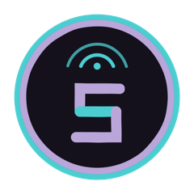

```
$ ssh kai@kai-server

┌────────────────────────────────────┐
│ kai-server · lights-out            │
│ operator: kai siren · east bay, ca │
│ status: agents working the line    │
└────────────────────────────────────┘
```

⚙⚒ lights out, platform's green, agents are working the line ⚒⚙

## `> whoami`


**Hi! I'm Kai.** I'm a Staff-level platform engineer, ten-plus years in. I build the governed platform layer that lets engineering teams develop, ship, and operate agentic systems safely. The work spans context composition, bounded execution, MCP delivery, model routing, observability, and the Kubernetes systems underneath.

Outside work, I run a two-site homelab and a public game server. They are practical testbeds for the same platform, reliability, and observability questions I work on professionally.

> [/work](https://coilysiren.me/work/) is the project-first map of what I'm building and how the systems fit together.

## `> lights_out`

The goal is unattended software work that stays bounded, inspectable, and recoverable. The current public stack covers four parts of that problem:

* **[ward](https://github.com/coilyco-flight-deck/ward)** - governed execution - runs unattended coding agents in fresh clones and least-access containers, with durable issue, branch, review, and outcome trails.
* **[cli-guard](https://github.com/coilyco-flight-deck/cli-guard)** - execution boundary - validates arguments, scopes filesystem access, gates repository state, controls egress, and records an append-only audit log.
* **[agent-compose](https://github.com/coilyco-flight-deck/agent-compose)** - context assembly - selects and compiles the instructions an agent starts with while keeping executable authority outside the bundle.
* **[agentic-os](https://github.com/coilyco-flight-deck/agentic-os)** - shared operating layer - carries cross-platform shell setup, public-safe agent skills, and the cross-repo validation catalog.

The observability work sits underneath that stack: local-first session data, materialized views over agent behavior, and model-facing query surfaces. The useful question is not whether an agent produced a diff. It is whether the system can explain what happened, recover from interruption, and prove the result.

## `> production_floor`

The work is split across four namespaces:

Each tag shows how many repositories in that namespace carry it. Repository names stay on the organization profile pages.

<table>
<tr>
<td width="112" align="center"><a href="https://github.com/coilyco-flight-deck"></a></td>
<td><strong><a href="https://github.com/coilyco-flight-deck">coilyco-flight-deck</a></strong> - public builds: the governed agent stack, shared developer environment, and fleet infrastructure. <a href="https://coilysiren.me/orgs/coilyco-flight-deck/">Organization profile</a>.<br><br>
<code>ai-agents (5)</code> · <code>ansible (1)</code> · <code>automation (7)</code> · <code>bluesky (1)</code> · <code>command-line (1)</code> · <code>devops (5)</code> · <code>dotfiles (1)</code> · <code>github-profile (1)</code> · <code>helm (1)</code> · <code>homelab (1)</code> · <code>homebrew (1)</code> · <code>infrastructure-as-code (1)</code> · <code>kubernetes (2)</code> · <code>llm (2)</code> · <code>mcp (6)</code> · <code>model-context-protocol (4)</code> · <code>observability (3)</code> · <code>opentelemetry (2)</code> · <code>personal-finance (1)</code> · <code>reddit (1)</code> · <code>rss (1)</code> · <code>scoop (1)</code> · <code>security (5)</code></td>
</tr>
<tr>
<td width="112" align="center"><a href="https://github.com/coilyco-bridge"></a></td>
<td><strong><a href="https://github.com/coilyco-bridge">coilyco-bridge</a></strong> - control surfaces: operator-specific context and deployment machinery. <a href="https://coilysiren.me/orgs/coilyco-bridge/">Organization profile</a>.<br><br>
<code>ai-agents (2)</code> · <code>automation (1)</code> · <code>benchmark (1)</code> · <code>comfyui (1)</code> · <code>data-visualization (1)</code> · <code>devops (4)</code> · <code>documentation (1)</code> · <code>generative-ai (1)</code> · <code>github-profile (1)</code> · <code>helm (1)</code> · <code>homelab (2)</code> · <code>kubernetes (1)</code> · <code>llm (1)</code> · <code>machine-learning (2)</code> · <code>mcp (1)</code> · <code>static-site (1)</code></td>
</tr>
<tr>
<td width="112" align="center"><a href="https://github.com/coilyco-gaming"></a></td>
<td><strong><a href="https://github.com/coilyco-gaming">coilyco-gaming</a></strong> - games and game tooling: games, simulations, mods, and game-service tooling. <a href="https://coilysiren.me/orgs/coilyco-gaming/">Organization profile</a>.<br><br>
<code>bevy (1)</code> · <code>discord (1)</code> · <code>eco-community-discord (1)</code> · <code>eco-game (4)</code> · <code>factorio (1)</code> · <code>game-development (1)</code> · <code>game-modding (3)</code> · <code>game-operations (1)</code> · <code>gaming (1)</code> · <code>github-profile (1)</code> · <code>go (1)</code> · <code>go-ops-tooling (1)</code> · <code>mcp (2)</code> · <code>message-dumps (1)</code> · <code>model-context-protocol (2)</code> · <code>procedural-galaxy-simulation (1)</code> · <code>rust (2)</code> · <code>rust-wasm (1)</code> · <code>steam (1)</code> · <code>telemetry (1)</code> · <code>unity (1)</code> · <code>webassembly (2)</code></td>
</tr>
<tr>
<td width="112" align="center"><a href="https://github.com/coilysiren"></a></td>
<td><strong><a href="https://github.com/coilysiren">coilysiren</a></strong> - personal work: this profile, <a href="https://coilysiren.me">coilysiren.me</a>, and private coordination surfaces.<br><br>
<code>ai-agents (2)</code> · <code>automation (1)</code> · <code>blog (1)</code> · <code>dataset (1)</code> · <code>devops (2)</code> · <code>documentation (1)</code> · <code>github-profile (1)</code> · <code>issue-tracker (1)</code> · <code>knowledge-base (1)</code> · <code>linkedin (1)</code> · <code>nlp (1)</code> · <code>observability (2)</code> · <code>personal-website (1)</code> · <code>project-management (1)</code> · <code>writing (1)</code></td>
</tr>
</table>

## `> k3s`

The fleet has two small k3s clusters. The primary site is the application and state plane. The second site is the operations and recovery plane. This is the deployment-declaration view, grouped by namespace rather than pod count.

### Application namespaces

* **`coilysiren-eco-*`** - the Eco companion stack, including the main service, Discord worker, and price calculator.
* **`atlas`, `factory-game`, `galaxy-gen`, `website`** - public and staging web surfaces.
* **`comfyui`, `open-webui`, `reference-media`** - private AI and media interfaces. ComfyUI keeps the GPU runtime on a tower and puts only its front door in k3s.
* **`forgejo-issues`** - the local issue mirror, synchronization workers, and query surfaces.
* **`*-mcp`** - narrowly scoped MCP services for node health, browsers, telemetry, project trackers, social sources, games, and infrastructure.

### Meta components

* **`authelia`** - OAuth 2.1 and OpenID Connect for hosted MCP clients. Per-service oauth2-proxy gates validate Authelia-signed access tokens.
* **`kube-system`, `cert-manager`, `external-dns`** - Traefik ingress, cluster DNS, Route 53 records, and DNS-01 certificates.
* **`external-secrets`** - cluster-side synchronization from AWS Systems Manager Parameter Store.
* **`tailscale`** - the operator and per-service proxies that publish private services onto the tailnet.
* **`forgejo`, `registry`, `flux-system`** - source hosting, the internal OCI registry, build and deploy runners, and staged GitOps reconciliation.
* **`observability`, `fleet-reachability`** - metrics, errors, traces, logs, and cross-site Gatus checks.
* **`agent-proxy`, `litellm`** - the ser8 inference control plane, kept separate from the application cluster.

## `> shift_report`

```yaml
role:     Senior Platform Engineer
employer: Kapwing

focus:
  - developer platforms
  - agentic tooling
  - observability
  - infrastructure and SRE

background:
  - urfave/cli maintainer
  - government infrastructure
  - multi-cloud platforms
  - engineering management
```

## `> tailnet`

The homelab spans two physical sites on one Tailscale mesh. Each site runs a small k3s cluster: the application and state plane at the primary site, then the operations and recovery plane at the second. GPU machines join on demand for local inference, while hosted frontier models handle work beyond the small local tier.

The durable choices are simple: isolate state, keep recovery on a different power and network path, make services observable, and assume every compute node except the primary can disappear. This profile keeps the architecture, not point-in-time device and pod dumps.

## `> stack`

Go, Python, TypeScript, Bash, C#. AWS, Kubernetes, Terraform, Docker, Tailscale. Prometheus, Grafana, Sentry, OpenTelemetry. Codex, Claude Code, MCP.

## `> service_history`

```
2025-now   Kapwing    Senior SWE
2023-2025  Nava       Principal Infra
2022-2023  Textio     Staff Infra
2021-2022  EnergyHub  DevOps EM
2020-2021  Bluelink   Senior Backend
2018-2020  Textio     Senior Infra
2016-2018  Callisto   Senior SWE
```

Older: Harlot, Quirell/CollectQT, NASA Goddard. Full résumé: [coilysiren.me/resume](https://coilysiren.me/resume).

## `> comms`

[coilysiren.me](https://coilysiren.me) · [Bluesky](https://bsky.app/profile/coilysiren.me) · [X](https://x.com/coilysiren) · [LinkedIn](https://linkedin.com/in/coilysiren)

## See also

* [AGENTS.md](AGENTS.md) - agent bootstrap guide and operating rules.
* [docs/FEATURES.md](docs/FEATURES.md) - inventory of what ships today.
* [.ward/ward.yaml](.ward/ward.yaml) - repository command policy.
